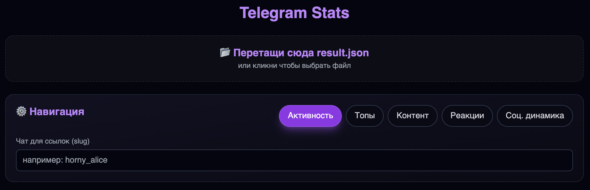

# Telegram Stats



## Локальная разработка (без Docker)
```bash
npm install
npm run dev
```
Открой URL из консоли (обычно http://localhost:5173). Перетащи файл `result.json` из экспорта Telegram.

## Экспорт чата
Telegram Desktop → Выбери чат → Дополнительно → Экспорт истории чата → Формат JSON.
